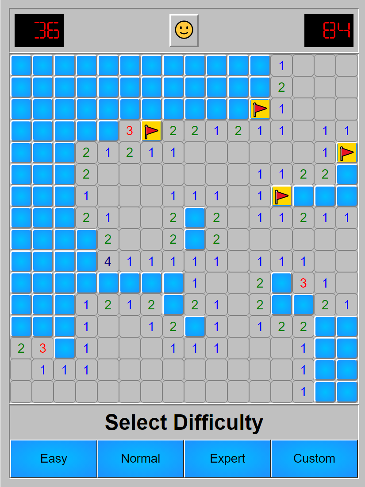
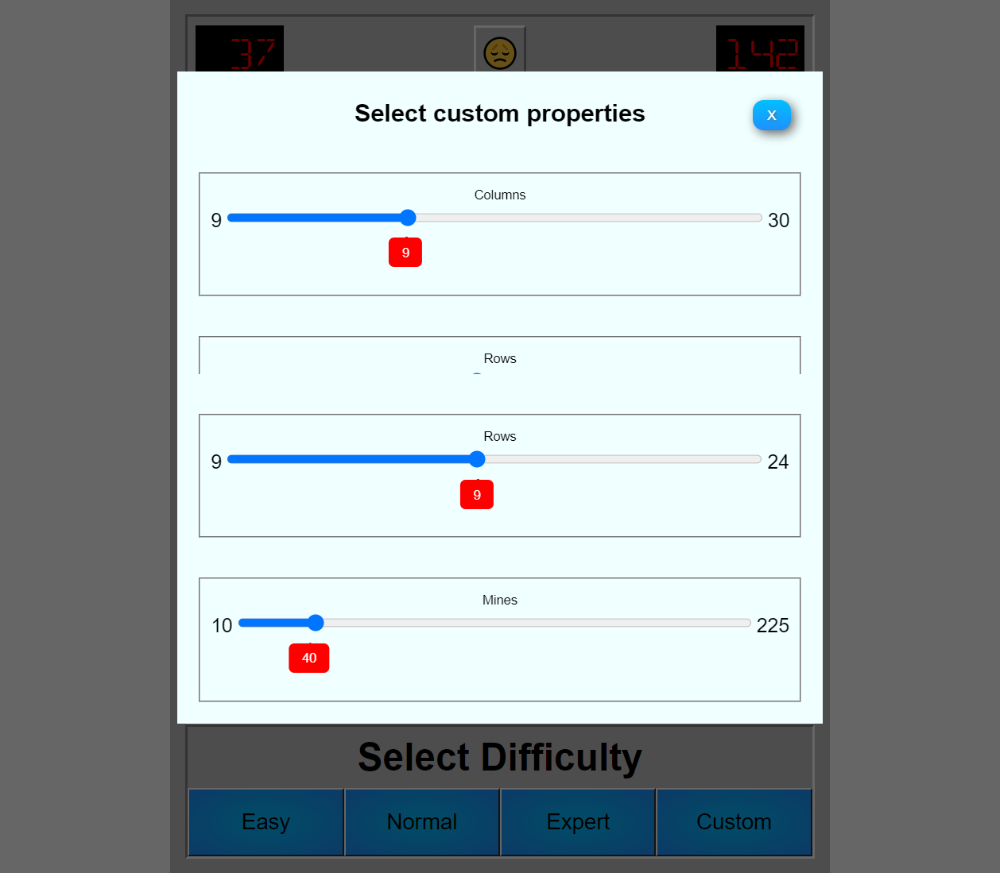

# Minesweeper

Minesweeper game based on React, React Redux with Redux Toolkit, TypeScript, Styled Components

## Table of contents

- [Minesweeper](#minesweeper)
  - [Table of contents](#table-of-contents)
  - [General info](#general-info)
  - [Screenshots](#screenshots)
  - [Technologies](#technologies)
  - [Setup](#setup)
  - [Demo](#demo)
  - [Features](#features)
  - [Status](#status)
  - [Contact](#contact)

## General info

Minesweeper is a single-player puzzle video game. The objective of the game is to clear a rectangular board containing hidden "mines" or bombs without detonating any of them, with help from clues about the number of neighboring mines in each field.

## Screenshots






## Technologies

- [React](https://pl.reactjs.org/) - version 16.13.1
- [React Redux](https://react-redux.js.org/) - version 7.2.1
- [Redux Toolkit](https://redux-toolkit.js.org/) - version 3.8.3
- [Styled Components](https://styled-components.com/) - version 5.2.0
- [TypeScript](https://www.typescriptlang.org/) - version 3.8.3

## Setup

1. Clone the repo

```sh
git clone https://github.com/Joanna-Chadzynska/Games-JS
```

```
cd Minesweeper
```

2. Install NPM packages

```sh
npm install
```

3. Start dev mode

```sh
npm start
```

4. Build version

```
npm run build
```

## Demo

<!-- <https://magic21.netlify.app/> -->

## Features

List of features ready and TODOs for future development

- Game mode selection
- Restart game in every mode (even if board is customized)

To-do list:

- Add unit tests using
- Fix timer
- Change layout

## Status

Project is: _finished_

## Contact

Created by [Joanna Chądzyńska](https://www.linkedin.com/in/joanna-chądzyńska/) - feel free to contact me!
